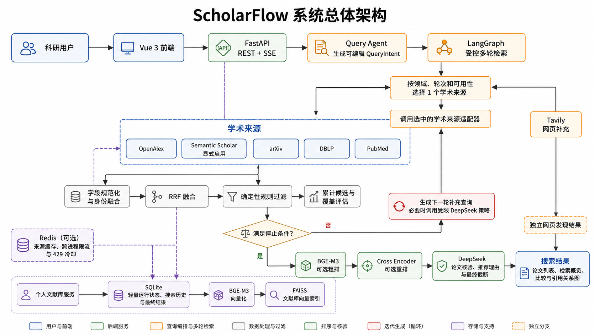
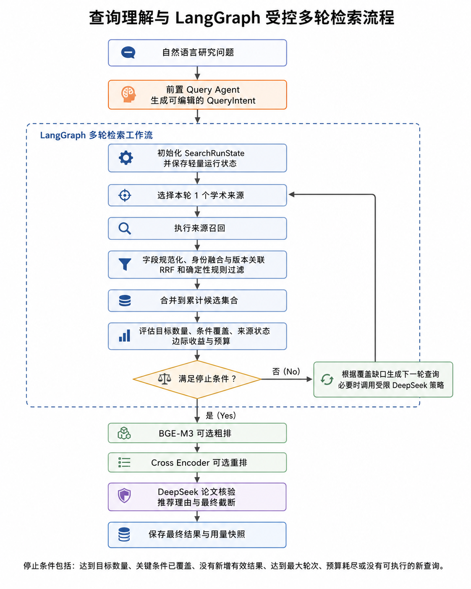
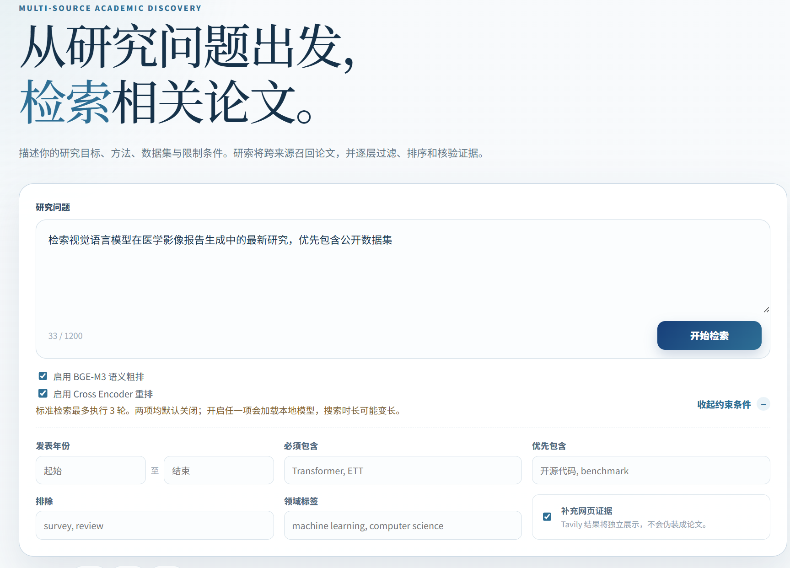
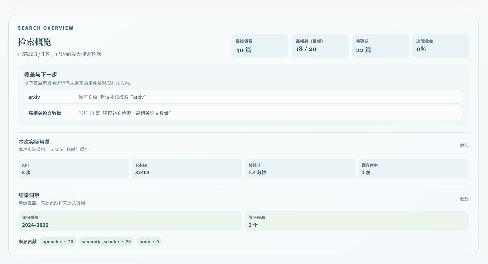
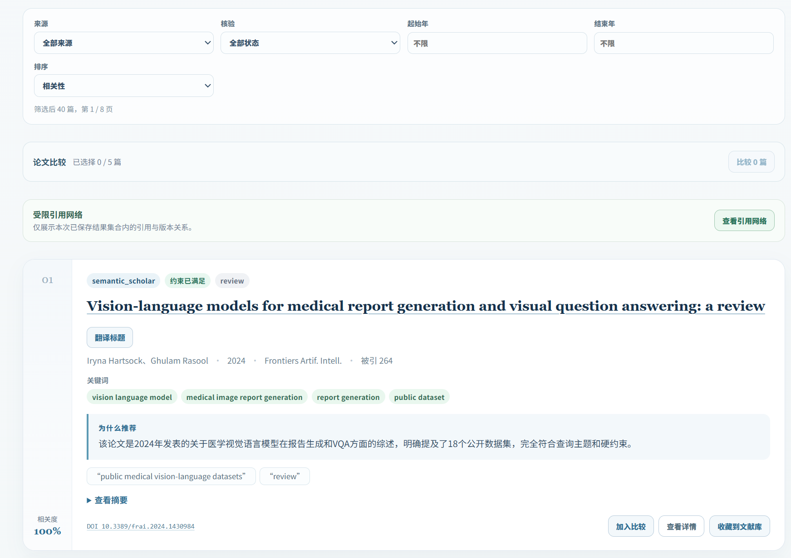
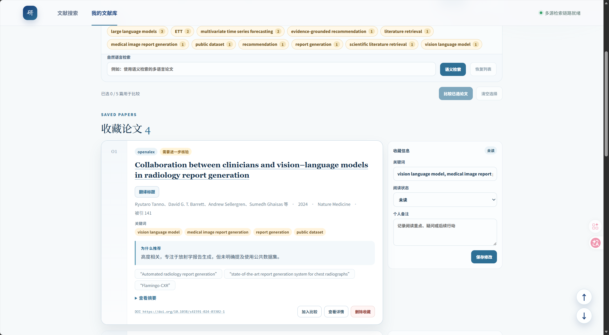

# ScholarFlow

ScholarFlow 是一个面向复杂科研问题的多源论文搜索与推荐系统。

系统先将自然语言研究问题解析为结构化检索意图，再按研究领域、检索轮次和来源可用性选择学术数据源。多轮候选生成结束后，系统统一完成语义排序、条件核验和结果保存，并提供论文详情、比较、引用关系图、搜索报告和个人文献库等功能。

## 主要功能

- **自然语言查询规划**：Query Agent 将研究问题转换为英文检索式、结构化 `QueryIntent` 和补充子查询。
- **结构化条件确认**：前端可以查看并修改 `QueryIntent`；修改后直接进入多轮检索，不重复调用 Query Agent。
- **多源论文检索**：以 OpenAlex 为首轮主来源；Semantic Scholar 在配置 API Key 并显式启用后参与路由，arXiv、DBLP 和 PubMed 按研究领域使用。
- **有限轮次检索**：LangGraph 负责编排来源选择、候选累计、覆盖评估、查询调整和停止判断。当前每轮只调用一个学术来源，最多执行三轮。
- **论文融合与去重**：统一不同来源的论文字段，按照 DOI、arXiv ID、PMID、来源平台 ID，以及标题、年份和作者识别重复论文，并保留可确认的版本关系。
- **分层筛选与排序**：每轮先完成身份融合、RRF 和确定性规则过滤；全部轮次结束后，可选使用 BGE-M3 和 Cross Encoder，并由 DeepSeek 完成复杂条件核验、推荐理由和最终结果截断。
- **搜索记录与结果恢复**：SQLite 保存轻量运行状态、搜索历史和最终结果快照。页面刷新后可以按 `run_id` 恢复状态并读取同次搜索结果。
- **引用关系图**：仅展示当前搜索结果集合内已有的引用和版本族事实，不扩展外部引文网络，也不读取 PDF 或调用模型补充关系。
- **个人文献库**：支持论文收藏、阅读状态、关键词、备注、筛选、论文比较和自然语言语义检索。
- **离线评测与消融实验**：支持 Precision、Recall、F1、MRR、nDCG、效率统计、排序前候选快照、覆盖诊断和分层排序对比。
- **可选 Redis**：用于学术来源响应缓存，以及跨进程请求限流和 429 冷却协调；Redis 不可用时自动回退到进程内机制。
- **网页补充发现**：Tavily 只在查询明确需要网页证据且已配置 API Key 时启用，结果独立展示，不参与论文身份融合、排序或引用关系图。

## 系统架构



系统主要分为以下几层：

1. Vue 3 前端负责查询输入、结构化条件确认、SSE 进度展示、结果筛选和文献管理。
2. FastAPI 提供 REST API、SSE 接口和业务服务入口。
3. Query Agent 在进入 LangGraph 之前，将自然语言问题转换为 `QueryIntent`。
4. LangGraph 控制有限轮次的来源召回、累计候选评估、查询演化和停止判断。
5. OpenAlex、Semantic Scholar、arXiv、DBLP 和 PubMed 提供论文数据；Tavily 仅提供独立的网页补充结果。
6. SQLite 保存搜索运行、最终结果和个人文献库；Redis 提供可选的来源缓存与跨进程限流；BGE-M3 和 FAISS 为个人文献库提供可重建的语义向量索引。

## LangGraph 检索工作流



系统采用有限轮次的候选生成策略：

1. Query Agent 将用户问题转换为检索式和 `QueryIntent`。
2. LangGraph 初始化 `SearchRunState`，并在来源调用前后保存轻量运行状态。
3. 每轮只调用一个按核心优先级、研究领域和当前轮次选择的学术来源。当前标准模式和深度模式均最多执行三轮。
4. 本轮结果依次经过字段规范化、身份融合、版本关联、RRF 和确定性规则过滤。
5. 系统将本轮论文合并到累计候选集合，并评估目标数量、条件覆盖、来源状态、边际收益和预算。
6. 未满足停止条件时，系统根据覆盖缺口生成下一条补充查询；必要时可调用一次受限的 DeepSeek 搜索策略，调用失败时回退到确定性查询演化。
7. 达到目标数量、最大轮次、预算边界、来源限制或没有可执行新查询时，结束候选生成。
8. 系统对全部轮次的候选统一执行一次可选 BGE-M3、可选 Cross Encoder 和 DeepSeek 论文核验，随后保存最终结果与用量快照。

Query Agent 在 LangGraph 启动前执行。多轮过程中的 DeepSeek 查询策略只在仍存在覆盖缺口时按受控条件调用；BGE-M3、Cross Encoder 和最终论文核验不会在每轮重复执行。

## 技术栈

- **后端**：Python 3.12、FastAPI、LangGraph、Pydantic、SQLAlchemy
- **前端**：Vue 3、TypeScript、Vite、D3
- **数据与索引**：SQLite、FAISS，可选 Redis
- **模型**：DeepSeek、BGE-M3、BGE Reranker
- **测试**：Pytest、Node.js Test Runner、tsx、vue-tsc

## 快速开始

### 创建 Conda 环境

```powershell
conda create -n scholarflow python=3.12 -y
conda activate scholarflow
```

### 安装后端依赖

仅运行后端：

```powershell
pip install -r requirements.txt
```

开发和测试：

```powershell
pip install -r requirements-dev.txt
```

`requirements-dev.txt` 已包含运行依赖，不需要同时重复安装两个文件。

### 安装前端依赖

```powershell
cd frontend
npm install
cd ..
```

### 配置环境变量

在仓库根目录复制配置模板：

```powershell
Copy-Item .env.example .env
```

根据启用的功能填写对应配置：

- DeepSeek：配置 `SCHOLARFLOW_DEEPSEEK_API_KEY`。
- Semantic Scholar：同时配置 `SCHOLARFLOW_SEMANTIC_SCHOLAR_API_KEY`，并将 `SCHOLARFLOW_SEMANTIC_SCHOLAR_ENABLED` 设为 `true`。
- Tavily：只有需要网页补充发现时才配置 `SCHOLARFLOW_TAVILY_API_KEY`。
- Redis：默认关闭；需要跨进程缓存和限流时，将 `SCHOLARFLOW_REDIS_ENABLED` 设为 `true`。

不要将 `.env`、API Key、数据库、日志、模型缓存、评测原始数据或真实用户数据提交到仓库。

### 启动项目

后端：

```powershell
uvicorn backend.app.main:app --reload
```

前端：

```powershell
cd frontend
npm run dev
```

前端默认地址为 `http://127.0.0.1:30000`，FastAPI OpenAPI 文档默认地址为 `http://127.0.0.1:8000/docs`。

## API 与数据源

业务 API 统一使用 `/api/v1` 前缀，完整接口和请求参数请查看 FastAPI OpenAPI 文档。

常用能力包括：

- 自然语言查询规划和可编辑 `QueryIntent`
- 多轮论文检索与 SSE 进度推送
- 搜索状态持久化、页面刷新恢复和中断运行回收
- 已保存结果的筛选、排序、分页和事实型综合报告
- 论文详情、字段翻译和 2–5 篇论文比较
- 当前搜索结果集合内的引用关系图
- 保守技术路线读取 API（当前前端暂未展示）
- 文献收藏、阅读状态、备注和语义检索
- 搜索用量与费用快照

后端重启不会续跑先前的异步搜索任务。启动时，遗留的 `pending` 或 `running` 记录会被标记为失败，用户可以根据历史记录重新发起检索。

主要数据源：

| 来源 | 用途 | 启用方式 |
| --- | --- | --- |
| OpenAlex | 首轮综合论文检索与元数据获取 | 默认启用 |
| Semantic Scholar | 语义与引用信息补充 | 配置 API Key 并显式启用 |
| arXiv | AI、计算机领域的预印本检索 | 按领域和轮次使用 |
| DBLP | 计算机领域会议与期刊书目检索 | 按领域和轮次使用 |
| PubMed | 医学和生命科学论文检索 | 按领域和轮次使用 |
| Tavily | 独立网页补充发现 | 查询明确需要且已配置 API Key |

Tavily 的网页发现与正式论文结果相互独立，不参与论文身份融合、分层排序或引用关系图构建。

## 模型与下载

模型按需加载。关闭相应功能时，不会加载对应本地模型。

| 用途 | 模型 |
| --- | --- |
| 查询规划、可选查询演化、复杂语义条件核验、推荐理由和翻译 | DeepSeek，由 `SCHOLARFLOW_DEEPSEEK_MODEL` 配置 |
| 语义嵌入与粗排 | `BAAI/bge-m3` |
| 精细重排序 | `BAAI/bge-reranker-v2-m3` |

如需提前下载本地模型，可在已激活的 Conda 环境中执行：

```powershell
python -c "from FlagEmbedding import BGEM3FlagModel; BGEM3FlagModel('BAAI/bge-m3')"
python -c "from FlagEmbedding import FlagReranker; FlagReranker('BAAI/bge-reranker-v2-m3')"
```

首次执行会从模型托管服务下载并缓存模型。离线部署时，应预先准备模型缓存，或者将模型名称替换为本地模型目录。

## 项目结构

```text
ScholarFlow/
├─ backend/
│  ├─ app/                 # FastAPI、LangGraph、来源适配器、排序与数据存储
│  └─ tests/               # 后端测试
├─ frontend/
│  ├─ src/                 # Vue 3 前端应用
│  └─ tests/               # 前端测试与引用图测试
├─ scripts/                # 项目维护脚本
├─ README/                 # README 使用的图片资源
├─ data/                   # SQLite、FAISS 与本地运行数据，不提交
├─ logs/                   # 运行日志，不提交
├─ .env.example            # 环境变量模板
├─ requirements.txt        # 后端运行依赖
├─ requirements-dev.txt    # 开发与测试依赖
├─ pytest.ini              # Pytest 配置
└─ AGENTS.md               # 项目开发约定
```

## 测试

后端：

```powershell
pytest backend/tests -q
```

前端：

```powershell
cd frontend
npm test
npm run test:graph
npm run typecheck:graph
npm run build
```

## 效果演示

### 检索页面



### 检索报告



### 检索结果



### 文献库


