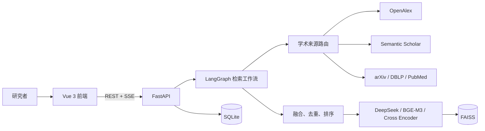

# ScholarFlow

ScholarFlow 是一个面向复杂科研问题的多源论文搜索与推荐系统。

系统将自然语言研究问题解析为结构化检索意图，根据研究领域动态选择学术数据源，并通过检索、融合、排序与约束核验生成可追溯的文献结果。

## 主要功能

- 自然语言查询规划：生成检索式与结构化查询条件。
- 多源论文检索：支持 OpenAlex、Semantic Scholar，并按领域使用 arXiv、DBLP、PubMed。
- 多阶段排序：结合规则过滤、RRF、BGE-M3、Cross Encoder 与 DeepSeek。
- LangGraph 多轮检索工作流：支持来源路由、结果融合、缺口评估和迭代检索。
- 搜索快照与文献库：SQLite 保存运行状态，支持论文详情、比较、收藏和语义搜索。
- 可选 Redis：提供缓存、限流和多进程协同能力。

## 系统架构



## LangGraph 检索工作流

系统采用多轮检索策略：

1. Query Agent 将自然语言问题转换为检索意图。
2. 根据领域和覆盖缺口选择合适数据源。
3. 对论文进行规范化、去重和融合。
4. 使用规则排序、本地模型和 LLM 完成精排与约束核验。
5. 达到目标数量或满足停止条件后保存搜索快照。

## 技术栈

- 后端：Python 3.12、FastAPI、LangGraph
- 前端：Vue 3、TypeScript、Vite
- 数据：SQLite、FAISS，可选 Redis
- 模型：DeepSeek、BGE-M3、BGE Reranker

## 快速开始

### 创建 Conda 环境

```powershell
conda create -n scholarflow python=3.12 -y
conda activate scholarflow
```

### 安装依赖

```powershell
pip install -r requirements.txt
pip install -r requirements-dev.txt
```

前端依赖：

```powershell
cd frontend
npm install
```

### 配置环境变量

复制配置模板：

```powershell
Copy-Item .env.example .env
```

根据启用功能配置 DeepSeek、OpenAlex、Semantic Scholar、Tavily 等 API Key。

### 启动

后端：

```powershell
uvicorn backend.app.main:app --reload
```

前端：

```powershell
npm run dev
```

## API 与数据源

主要 API 使用 `/api/v1` 前缀，完整接口说明请查看 FastAPI OpenAPI 文档。

主要数据源：

| 来源 | 用途 |
|---|---|
| OpenAlex | 核心论文检索 |
| Semantic Scholar | 论文检索与引用信息 |
| arXiv | 预印本检索 |
| DBLP | 计算机领域论文 |
| PubMed | 医学生命科学论文 |
| Tavily | 可选网页补充发现 |

## 模型与下载

模型按需加载。

| 用途 | 模型 |
|---|---|
| LLM 规划、精排、核验、翻译 | DeepSeek |
| 语义嵌入与粗排 | BAAI/bge-m3 |
| 重排序 | BAAI/bge-reranker-v2-m3 |

预下载本地模型：

```powershell
python -c "from FlagEmbedding import BGEM3FlagModel; BGEM3FlagModel('BAAI/bge-m3')"
python -c "from FlagEmbedding import FlagReranker; FlagReranker('BAAI/bge-reranker-v2-m3')"
```

不要提交 API Key、模型缓存、数据库和用户数据。

## 项目结构

```text
ScholarFlow/
├─ backend/       # FastAPI 后端、LangGraph 工作流与服务
├─ frontend/      # Vue 3 前端
├─ docs/          # 设计文档与开发记录
├─ data/          # 本地数据，不提交
├─ logs/          # 日志，不提交
└─ requirements*  # Python 依赖
```

## 测试

```powershell
pytest backend/tests
cd frontend
npm test
npm run build
```

详细设计、配置说明和开发记录请查看 `docs/`。