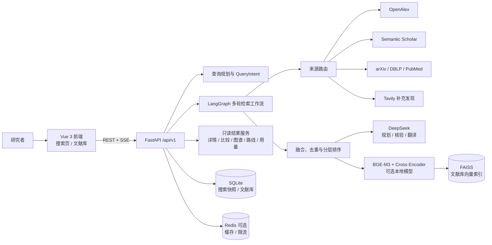
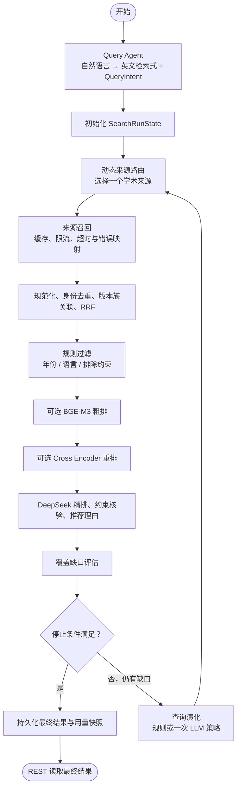

# ScholarWeave（研索）

ScholarWeave 是面向复杂科研问题的多源论文搜索与推荐系统。仓库目录与环境变量前缀暂保留历史名称 `ScholarFlow`；产品名称为“研索”。

系统不是通用网页搜索或普通 RAG：它先将自然语言问题解析为结构化检索意图，再按领域选择学术来源、规范化融合、去重、分层排序与约束核验，最后将可追溯结果保存为本地搜索快照。

## 功能概览

- 自然语言查询规划：生成英文检索式与 `QueryIntent`，支持用户编辑后的直接重搜。
- 多轮学术检索：核心来源为 OpenAlex、Semantic Scholar；按领域按需使用 arXiv、DBLP、PubMed；Tavily 仅提供独立网页补充发现。
- 分层排序：规则过滤 → RRF → 可选 BGE-M3 粗排 → 可选 Cross Encoder 重排 → DeepSeek 约束核验、精排与推荐理由。
- 搜索运行快照：SQLite 保存运行状态、最终结果、用量、综合报告与可恢复 URL `run_id`。
- 文献工作台：论文详情、字段级翻译、2–5 篇比较、受限引用网络、保守技术路线、收藏与文献库语义搜索。
- 可选 Redis：来源响应缓存、跨进程限流与健康状态；不可用时自动回退 SQLite 与进程内路径。

## 整体架构



## LangGraph 检索工作流

标准检索最多执行三轮；每轮只选择一个领域相关的学术来源，避免重复消耗受限来源配额。达到目标数量、连续无新增高质量论文、约束覆盖或预算边界时应停止。



## 快速开始

### 前置条件

- Python 3.12。
- Node.js 与 npm。
- 可选：本地 Redis。未启用或不可用时，后端仍可启动。
- 至少配置 OpenAlex、DeepSeek 等所需 API Key；具体取决于启用的来源和功能。

### 1. 配置环境变量

在仓库根目录复制示例文件，并仅在本地填写密钥：

```powershell
Copy-Item .env.example .env
```

不要提交 `.env`、`data/`、`logs/`、模型缓存或 Redis 持久化文件。环境变量字段、注释和顺序应与 [`.env.example`](.env.example) 保持一致。

### 2. 安装后端依赖

```powershell
pip install -r requirements.txt
pip install -r requirements-dev.txt
```

### 3. 安装前端依赖

```powershell
cd frontend
npm install
cd ..
```

### 4. 启动本地开发环境

终端一：

```powershell
uvicorn backend.app.main:app --reload
```

终端二：

```powershell
cd frontend
npm run dev
```

前端默认运行在 `http://localhost:5173`，通过 Vite 代理访问默认后端 `http://127.0.0.1:8000`。可用 `SCHOLARFLOW_BACKEND_URL` 覆盖代理目标，或在部署环境设置 `VITE_API_BASE_URL`。

FastAPI OpenAPI 文档：`http://127.0.0.1:8000/docs`。

## API 概览

所有业务 API 的前缀为 `/api/v1`。错误响应使用稳定结构：

```json
{
  "error": {
    "code": "...",
    "message": "...",
    "request_id": "...",
    "retryable": false,
    "details": {}
  }
}
```

| 模块 | 主要端点 | 说明 |
| --- | --- | --- |
| 健康检查 | `GET /health` | 返回服务与 Redis 的可用/降级状态。 |
| 查询与召回 | `POST /search/natural-multi-round/events` | 推荐入口；以 SSE 返回进度，完成后使用 `run_id` 读取快照。 |
| 查询与召回 | `POST /search/natural-multi-round`、`POST /search/multi-round` | 返回有限轮多源检索结果。 |
| 运行状态 | `GET /search/runs`、`GET /search/runs/{run_id}` | 读取本地运行历史和可恢复状态。 |
| 已保存结果 | `GET /search/runs/{run_id}/result`、`GET /search/runs/{run_id}/papers` | 读取同次最终结果；后者支持筛选、排序、分页。 |
| 搜索洞察 | `GET /search/runs/{run_id}/synthesis`、`GET /usage/{run_id}` | 只读取 SQLite 快照，不重新调用来源、模型或 PDF。 |
| 运行清理 | `DELETE /search/runs/{run_id}` | 仅允许显式清理终态运行；运行中记录返回冲突。 |
| 论文 | `GET /papers/detail`、`POST /papers/translation/{field}` | 从搜索快照或本地收藏读取详情；按需翻译 `title` / `abstract`。 |
| 比较 | `POST /compare` | 比较 2–5 篇已保存论文的事实字段与证据。 |
| 引用网络 | `GET /graph/citations` | 只展示当前集合已有的 `cites` / `same_work` 关系。 |
| 技术路线 | `GET /routes` | 基于已保存关键词的保守分类，不调用模型。 |
| 文献库 | `POST/GET /library/items`、`PATCH/DELETE /library/items/{id}` | 收藏、筛选、更新与删除本地关联。 |
| 文献库语义检索 | `GET /library/items/semantic-search` | 在收藏集合内使用 BGE-M3、FAISS 与 SQLite 映射检索。 |
| 补充发现翻译 | `POST /discoveries/translation/{field}` | 仅翻译当前运行已保存的网页发现标题或片段。 |

### 推荐检索流程

1. 调用 `POST /api/v1/search/natural-multi-round/events`，请求中提交自然语言问题、年份、must/should/exclude 条件、领域和本地模型开关。
2. 消费 SSE 的进度事件；事件不是最终事实源。
3. 从完成事件取得 `run_id` 后，调用 `GET /api/v1/search/runs/{run_id}/papers?page=1&page_size=20&sort=relevance`。
4. 按需读取 `result`、`synthesis`、`usage`、`graph/citations` 或 `routes`。

搜索图、技术路线、比较、详情和综合报告均只基于已保存结果，禁止在这些读取路径上重新抓取来源、读取 PDF 或调用 LLM。

## 模型与下载

模型均由业务功能首次实际使用时懒加载；关闭相应开关不会加载本地模型。

| 用途 | 默认模型 | 下载/调用时机 |
| --- | --- | --- |
| 查询规划、LLM 精排、约束核验、推荐理由、字段翻译 | `deepseek-v4-flash` | 通过 DeepSeek OpenAI 兼容 API 调用，需要 API Key。 |
| 语义粗排、文献库嵌入 | `BAAI/bge-m3` | 用户启用 BGE 粗排或首次文献库语义搜索时，通过 FlagEmbedding 下载并缓存。 |
| 精细重排 | `BAAI/bge-reranker-v2-m3` | 用户启用 Cross Encoder 重排时，通过 FlagEmbedding 下载并缓存。 |

如需在联网环境预下载本地模型，可手动执行：

```powershell
python -c "from FlagEmbedding import BGEM3FlagModel; BGEM3FlagModel('BAAI/bge-m3')"
python -c "from FlagEmbedding import FlagReranker; FlagReranker('BAAI/bge-reranker-v2-m3')"
```

上述命令会访问模型托管服务；离线部署应先在受控环境准备模型缓存或将模型标识替换为本地目录。不要把下载后的模型文件提交到仓库。

### 关键模型配置

| 环境变量 | 默认值 | 作用 |
| --- | --- | --- |
| `SCHOLARFLOW_LLM_RANKING_ENABLED` | `true` | 是否启用 DeepSeek 精排、约束核验和理由生成。 |
| `SCHOLARFLOW_DEEPSEEK_MODEL` | `deepseek-v4-flash` | 查询规划与 LLM 服务模型名。 |
| `SCHOLARFLOW_DEEPSEEK_LLM_BATCH_SIZE` | `10` | 每个 LLM 精排小批次论文数，允许 5–10。 |
| `SCHOLARFLOW_DEEPSEEK_LLM_TIMEOUT_SECONDS` | `30` | 单个精排批次超时秒数。 |
| `SCHOLARFLOW_DEEPSEEK_MAX_OUTPUT_TOKENS` | `4000` | 单批结构化输出 Token 上限。 |
| `SCHOLARFLOW_SEMANTIC_RANKING_ENABLED` | `true` | 是否允许前端启用 BGE-M3 粗排。 |
| `SCHOLARFLOW_CROSS_ENCODER_RANKING_ENABLED` | `true` | 是否允许前端启用 Cross Encoder 重排。 |
| `SCHOLARFLOW_LOCAL_MODEL_DEVICE` | `auto` | `auto`、`cpu` 或 `cuda`；两个本地模型共用。 |
| `SCHOLARFLOW_LOCAL_MODEL_MINIMUM_CUDA_MEMORY_MB` | `4096` | `auto` 选择 CUDA 的最小总显存。 |
| `SCHOLARFLOW_LLM_MINIMUM_RELEVANCE_SCORE` | `0.35` | 最终推荐的最低 LLM 相关度阈值。 |

`auto` 在 CUDA 可用且显存满足阈值时使用 CUDA，否则回退 CPU；CUDA 下本地模型使用 FP16。首次加载会明显增加搜索耗时，前端应让用户显式选择 BGE-M3 和 Cross Encoder。

## 数据源、缓存与限流

| 来源 | 角色 | 关键边界 |
| --- | --- | --- |
| OpenAlex | 核心论文来源 | 使用 API Key、超时与规范化适配器。 |
| Semantic Scholar | 核心论文来源 | 默认 1 RPS；首次 429 固定等待 3 秒补发一次，再进入进程内/Redis 冷却。 |
| arXiv、DBLP | AI/计算机领域按需来源 | 不与所有来源无条件并发调用。 |
| PubMed | 医学/生命科学按需来源 | 匿名 E-utilities 限制为 3 RPS。 |
| Tavily | 补充网页发现 | 仅在 `requires_web_evidence=true` 且已配置时调用；不会伪装成论文、进入去重或引用图。 |

Redis 默认关闭。启用后使用 DB 0 和 `ScholarFlow` 键前缀，负责来源响应缓存、跨进程限流及冷却同步；Redis 故障不会阻断 SQLite 搜索闭环。

## 技术路线与数据边界

### 领域契约

- `QueryIntent`：查询主题、约束、年份、领域、来源路由与本地模型开关。
- `PaperRecord`：统一论文身份、元数据、来源、引用和排序字段。
- `SearchRunState`：运行状态、轮次、来源使用、用量、覆盖缺口和停止原因。
- `SearchResult`：同次最终论文、核验结果、推荐理由与独立网页发现。
- `SupplementalDiscoveryItem`：网页发现的独立对象，绝不伪装成论文。

### 身份与排序

1. 身份去重优先级：DOI → arXiv ID → PMID → 来源平台 ID → 标题 + 年份 + 作者。
2. 版本族使用已保存 `work_family_id` 关联，不靠模型猜测。
3. 排序与核验只作用于规范化论文；网页发现不参与论文身份、引用或排序。
4. 低于 `0.35` 的 LLM 相关度视为低质量；`0.35–0.59` 为部分相关；`≥0.60` 为高相关。
5. 引用图只读取当前搜索快照中的 `references` 与 `work_family_id` 事实，不扩展外部引文网络。

## 目录结构

```text
ScholarFlow/
├─ backend/
│  ├─ app/
│  │  ├─ adapters/       # 学术来源、DeepSeek、BGE、Cross Encoder 等可替换外部适配器
│  │  ├─ agents/         # LangGraph 节点与工作流
│  │  ├─ api/            # FastAPI 路由、请求和响应模型
│  │  ├─ core/           # 配置、日志、异常与通用基础设施
│  │  ├─ models/         # QueryIntent、PaperRecord、SearchRunState 等领域契约
│  │  ├─ repositories/   # SQLite、Redis、FAISS 数据访问封装
│  │  └─ services/       # 查询、召回、去重、排序、图谱、路线与文献库业务
│  └─ tests/             # 后端离线单元测试
├─ frontend/
│  ├─ src/
│  │  ├─ components/     # 检索、论文、引用图和文献库组件
│  │  ├─ pages/          # 页面级 Vue 组件
│  │  ├─ services/       # REST/SSE 客户端
│  │  ├─ styles/         # 前端样式
│  │  └─ utils/          # 可测试的前端纯函数，如引用图布局
│  └─ tests/             # Node/TypeScript 前端测试
├─ docs/                 # 阶段规划、决策记录、验收清单
├─ data/                 # 本地 SQLite 与 FAISS 索引，不提交
├─ logs/                 # 运行日志，不提交
├─ .env.example          # 可提交的环境变量模板
├─ requirements.txt      # Python 运行时依赖
├─ requirements-dev.txt  # Python 开发/测试依赖
└─ pytest.ini            # 后端测试收集与导入约定
```

## 验证命令

后端测试应从仓库根目录执行：

```powershell
pytest backend/tests
```

前端常用验证：

```powershell
cd frontend
npm test
npm run test:graph
npm run typecheck:graph
npm run build
```

真实学术来源 smoke 测试需要用户显式授权、有效密钥和网络；默认单元测试不访问第三方 API、不下载模型。

## 安全与贡献约定

- 不提交 `.env`、API Key、SQLite、FAISS、日志、模型文件或真实用户数据。
- 所有第三方 API、模型和存储访问放在 `adapters/`、`repositories/` 或配置层，不散落在业务逻辑中。
- 读取搜索运行结果、图谱、路线、用量和综合报告时不得产生新的来源调用或模型费用。
- 提交前检查 `git status` 与 `git diff --check`；提交信息使用中文 Conventional Commits，例如 `docs: 完善项目说明文档`。

## 当前实施重点

搜索闭环、SQLite 快照恢复、SSE 进度、技术路线、用量、比较、受限引用图、文献库与文献库语义检索均已具备基础闭环。下一步以真实环境验收清单验证搜索运行、来源降级和失败安全摘要，再决定后续扩展范围。
