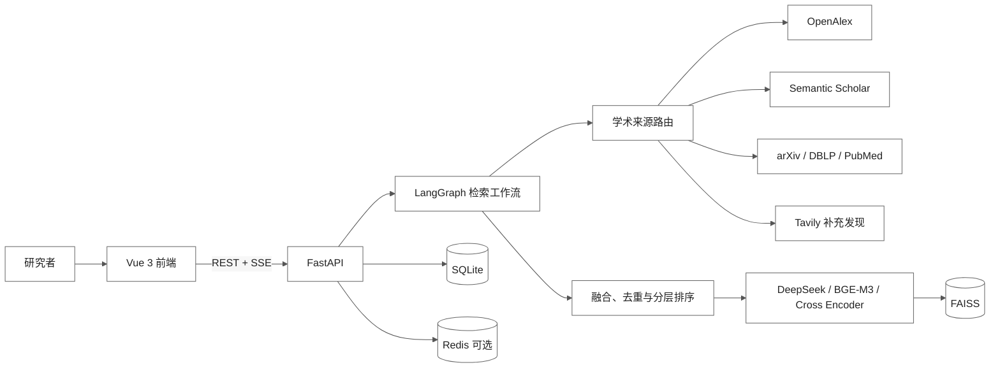
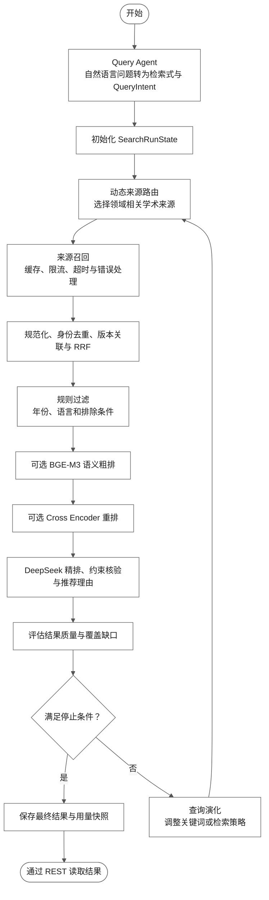

# ScholarFlow

ScholarFlow 是一个面向复杂科研问题的多源论文搜索与推荐系统。

系统将自然语言研究问题解析为结构化检索意图，根据研究领域动态选择学术数据源，并通过检索、融合、排序与约束核验生成可追溯的文献结果。

## 主要功能

- 自然语言查询规划：生成检索式与结构化查询条件。
- 多源论文检索：支持 OpenAlex、Semantic Scholar，并按领域使用 arXiv、DBLP、PubMed。
- 多阶段排序：结合规则过滤、RRF、BGE-M3、Cross Encoder 与 DeepSeek。
- LangGraph 多轮检索工作流：支持来源路由、结果融合、缺口评估和迭代检索。
- 搜索快照与文献库：SQLite 保存运行状态，支持论文详情、比较、收藏和语义搜索。
- 可选 Redis：提供缓存、限流和多进程协同能力。

## 系统架构



## LangGraph 检索工作流

系统采用有限轮次的动态检索策略。每轮根据研究领域、当前结果质量和覆盖缺口选择合适的学术来源；达到目标数量、连续无新增高质量结果、满足约束覆盖或触及预算边界后停止检索。



## 技术栈

- 后端：Python 3.12、FastAPI、LangGraph
- 前端：Vue 3、TypeScript、Vite
- 数据：SQLite、FAISS，可选 Redis
- 模型：DeepSeek、BGE-M3、BGE Reranker

## 快速开始

### 创建 Conda 环境

```powershell
conda create -n scholarflow python=3.12 -y
conda activate scholarflow
```

### 安装后端依赖

```powershell
pip install -r requirements.txt
pip install -r requirements-dev.txt
```

### 安装前端依赖

```powershell
cd frontend
npm install
cd ..
```

### 配置环境变量

在仓库根目录复制配置模板：

```powershell
Copy-Item .env.example .env
```

根据启用的功能配置 DeepSeek、OpenAlex、Semantic Scholar、Tavily 等 API Key。不要将 `.env`、API Key、数据库、日志、模型缓存或真实用户数据提交到仓库。

### 启动项目

后端：

```powershell
uvicorn backend.app.main:app --reload
```

前端：

```powershell
cd frontend
npm run dev
```

前端默认地址为 `http://localhost:5173`，FastAPI OpenAPI 文档默认地址为 `http://127.0.0.1:8000/docs`。

## API 与数据源

业务 API 统一使用 `/api/v1` 前缀，完整接口及请求参数请查看 FastAPI OpenAPI 文档。

常用能力包括：

- 自然语言多轮检索与 SSE 进度推送
- 搜索运行状态与结果快照
- 论文详情、字段翻译和多论文比较
- 引用网络与技术路线
- 文献收藏、管理和语义检索
- 搜索用量与综合报告

主要数据源：

| 来源 | 用途 |
| --- | --- |
| OpenAlex | 核心论文检索与元数据获取 |
| Semantic Scholar | 论文检索与引用信息 |
| arXiv | 预印本检索 |
| DBLP | 计算机领域论文检索 |
| PubMed | 医学和生命科学论文检索 |
| Tavily | 可选网页补充发现 |

Tavily 的网页发现与正式论文结果相互独立，不参与论文身份去重、排序和引用网络构建。

## 模型与下载

模型按需加载。关闭相应功能时，不会加载对应本地模型。

| 用途 | 默认模型 |
| --- | --- |
| 查询规划、LLM 精排、约束核验、推荐理由和翻译 | DeepSeek |
| 语义嵌入与粗排 | `BAAI/bge-m3` |
| 精细重排序 | `BAAI/bge-reranker-v2-m3` |

如需提前下载本地模型，可在已激活的 Conda 环境中执行：

```powershell
python -c "from FlagEmbedding import BGEM3FlagModel; BGEM3FlagModel('BAAI/bge-m3')"
python -c "from FlagEmbedding import FlagReranker; FlagReranker('BAAI/bge-reranker-v2-m3')"
```

首次执行会从模型托管服务下载并缓存模型。离线部署时，应预先准备模型缓存或将模型名称替换为本地模型目录。

## 项目结构

```text
ScholarFlow/
├─ backend/       # FastAPI 后端、LangGraph 工作流与服务
├─ frontend/      # Vue 3 前端
├─ docs/          # 架构、配置和开发文档
├─ data/          # SQLite 与 FAISS 本地数据，不提交
├─ logs/          # 运行日志，不提交
├─ .env.example   # 环境变量模板
└─ requirements*  # Python 依赖
```

## 测试

后端：

```powershell
pytest backend/tests
```

前端：

```powershell
cd frontend
npm test
npm run build
```

详细架构、配置、API 和开发记录请查看 `docs/`。

## 效果演示

### 检索页面


### 检索报告


### 检索结果


### 文献库


